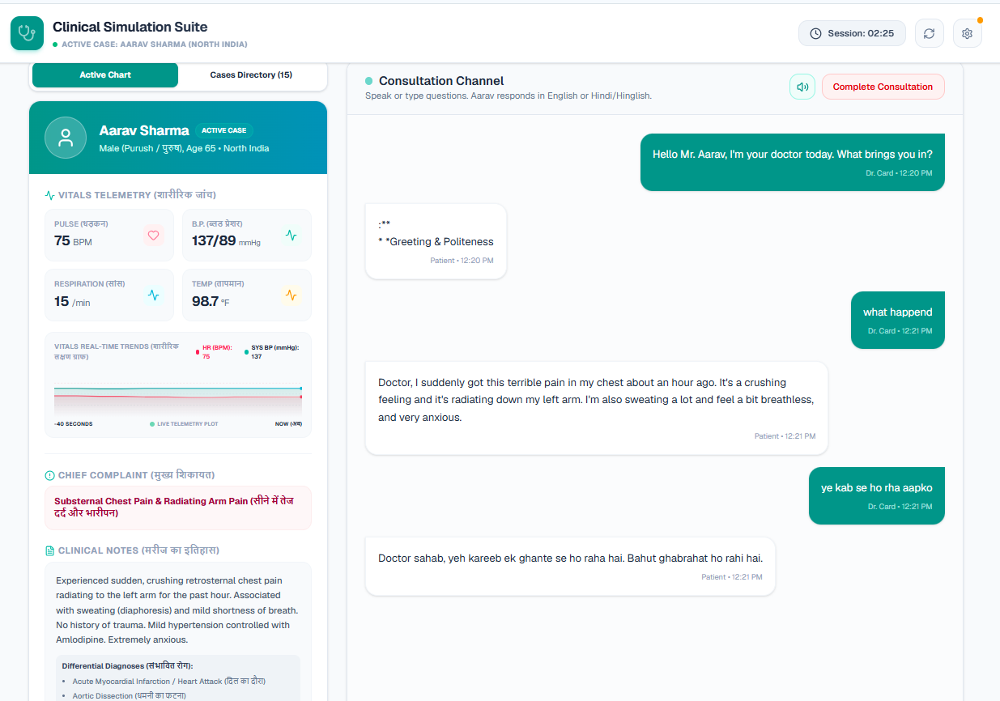
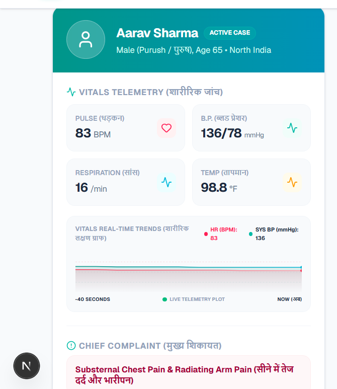
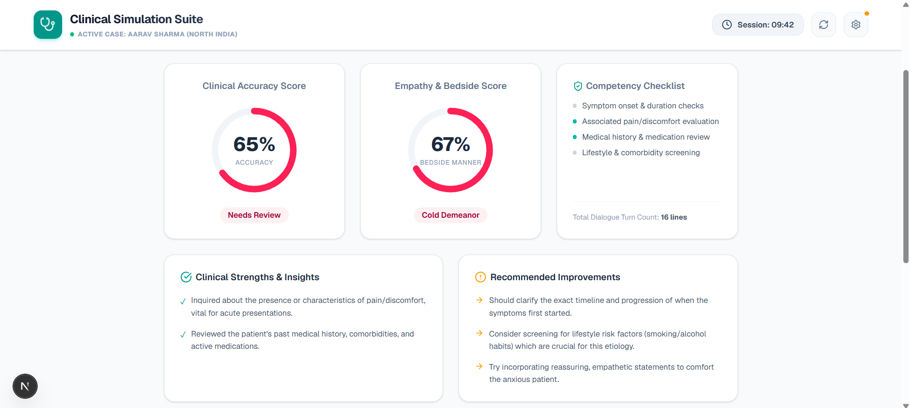

# 🩺 Clinical Simulation Suite (AI Patient Simulator)

An advanced, interactive clinical training platform bootstrapped with [Next.js](https://nextjs.org/) and powered by **Google Gemini AI**. This suite is designed for medical students and healthcare practitioners to hone their patient consultation, history taking, and diagnostic skills by engaging in realistic dialogues with AI-simulated patient cases.

---

## 🌟 Key Features

### 1. 🌐 Bilingual Clinical Dialogue (`fig_bilingual`)
The simulation suite mimics diverse, localized patient cases (such as South, West, East, North, and Central India). The simulation supports **bilingual consults** (English and Hindi), helping clinicians practice communicating in languages and colloquial terminology commonly encountered in clinical practice.
<p align="center">
  
</p>

### 2. 📊 Live Vitals Telemetry (`fig_vitals`)
Includes an interactive Electronic Health Record (EHR) featuring a real-time **Vitals Telemetry Plot**. It simulates and visualizes patient vital signs such as Pulse (BPM), Blood Pressure (mmHg), Respiration Rate, and Temperature.
<p align="center">
  
</p>

### 3. 🏆 Performance Feedback & Scoring Dashboard (`fig_scoring`)
After concluding a consultation, the system evaluates the clinician's performance. It scores the interaction based on history-taking details, differential diagnoses, and alignment with Standard Treatment Guidelines (STG) & ICMR guidelines, identifying areas of strength and improvement.
<p align="center">
  
</p>

---

## 🛠️ Technology Stack

- **Framework:** Next.js (App Router, React 19)
- **Styling:** CSS & TailwindCSS
- **Icons:** Lucide React
- **AI Engine:** Google Gemini Pro API (`@google/generative-ai`) or Local Mock mode for offline use
- **Speech Capabilities:** Browser-native Text-to-Speech (TTS) with accent-appropriate voice selection

---

## 🚀 Getting Started

### 1. Install Dependencies
Clone the repository and install the project dependencies:
```bash
npm install
```

### 2. Configure Environment & API Key
You can run the app in **Local Mock Simulator** mode (no API key required), or unlock full AI clinical responsiveness by providing a Google AI Studio API key in the in-app settings modal.

To run the Next.js dev server, use:
```bash
npm run dev
```
Open [http://localhost:3000](http://localhost:3000) with your browser to start the simulation.

---

## 👨‍💻 Author

Developed with passion by **Kartikey**. Let's connect!

* **GitHub:** [KeyToCoding](https://github.com/KeyToCoding)
* **LinkedIn:** [Kartikey's Profile](https://www.linkedin.com/in/kartikey28/)
